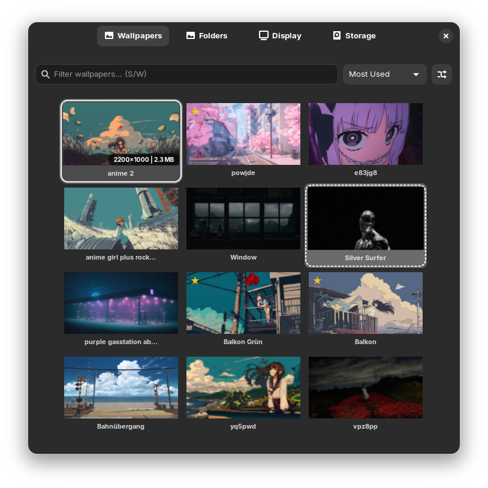

<div align="center">
  
  <h1>Wallpicker</h1>
</div>

Wallpicker is a modern and high-performance GNOME extension designed for wallpaper management across Wayland and X11 sessions. It allows you to browse, manage, and change your wallpapers directly from the top bar through a beautiful and responsive Libadwaita gallery.

- **High-Performance Gallery:** Browse your library via a GPU-accelerated GTK4/Libadwaita grid.
- **Multiple Wallpaper Folders:** Add several source directories for wallpapers.
- **Async Execution:** Asynchronous scanning and thumbnail generation to keep the Shell responsive.
- **Favorites & Navigation:** Star your best wallpapers and use power-user shortcuts (S, F, W, O, D, etc.).
- **Smart Shuffle:** Instinctively swap wallpapers with a single click.
- **Intelligent Sorting:** Sort by A-Z, Favorites, Newest, Most Used, or Recently used.

## Installation

#### Dependencies

- `glib-compile-schemas` to install the settings schema.
  - Arch: `glib2`
  - Debian/Ubuntu: `libglib2.0-bin`
  - Fedora: `glib2-devel`

#### From extensions.gnome.org (Recommended)

[](https://extensions.gnome.org/extension/9476/wallpicker/)

#### Manual installation

1. Clone the repository:
   ```bash
   git clone https://github.com/OMARxKHALID/Wallpicker.git ~/.local/share/gnome-shell/extensions/wallpicker@omarxkhalid.github.io
   ```
2. Compile the schema:
   ```bash
   glib-compile-schemas ~/.local/share/gnome-shell/extensions/wallpicker@omarxkhalid.github.io/schemas/
   ```
3. Log out and back in (or restart the X11 session).

## Reporting issues

You can report issues in our [Issue Tracker](https://github.com/OMARxKHALID/Wallpicker/issues). Before submitting, please check for existing issues and provide the following:

- Distribution and version (e.g., Zorin OS 18, Fedora 41)
- GNOME Shell version
- Extension version

## Screenshot

<div align="center">
  
</div>

## Get involved

Any type of contribution is appreciated! Check out our [CONTRIBUTING.md](CONTRIBUTING.md) for technical guidelines.

- **Code:** If you are interested in contributing code, please follow the "Why over What" commenting philosophy described in the project.
- **Translating:** Feel free to open a pull request with new localization files.

Don't forget to star the project if you like it! 💫

## Contributors

<a href="https://github.com/OMARxKHALID/Wallpicker/graphs/contributors">
  
</a>

<br/>

Made with [contrib.rocks](https://contrib.rocks)
